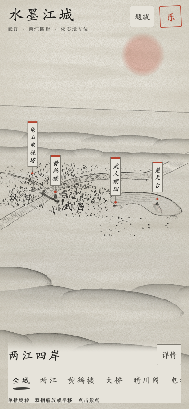

# 水墨江城体验修复验收

实施日期：2026-09-27。基线：`41632ab`。工作分支：`codex/repair-map-experience`。PR：[#6](https://github.com/GaoFei2025-0314/shuimo-jiangcheng/pull/6)。

## 修复结果

- 构建直接拼接、检查和压缩源文件，兼容 macOS 系统 Bash 3.2；Node 缺失或源码语法错误会中止，保留上次有效文件。Terser 缺失或执行失败时仍输出已检查的未压缩版本。
- 依赖加载分为加载中、就绪和失败；Three.js 先于两个扩展，GSAP 并行，依赖总超时 15 秒。首帧成功后启用导航；失败、初始化异常和 WebGL 上下文丢失均可刷新重试。字体服务卡住也不阻塞地图。
- 镜头和说明文字只保留最后一次选择，手势立即取消飞行。系统减少动态效果偏好实时生效，镜头直接切换，水面、烟雾、舟船和飞鸟停止自动运动。
- 宽度 ≤640px 或高度 ≤500px 使用紧凑布局。题跋与详情互斥，导航横向滚动，按钮触摸区至少 44px。预设镜头按实际界面占用和模型包围盒取景，四边预留 10%；手动浏览后改变窗口保留镜头位置。
- 牌签与界面、其他牌签保持至少 8px 间距，聚焦牌签优先，越界牌签隐藏。隐藏或尚在入场淡入的牌签不进入焦点顺序与无障碍树；需要隐藏正在聚焦的牌签时，焦点转到对应导航按钮。地名让开牌签，镜头静止时复用排版结果。

建筑、河道、山体、着色器和音乐合成保持原实现；没有修改生产部署配置、CDN 地址或运行时库版本，也没有增加页面对外 API。

## 复现与验证

```sh
npm ci
npx playwright install chromium webkit
npm test
node tests/live-smoke.cjs chromium
node tests/live-smoke.cjs webkit
```

最终功能代码提交：`78628ab`。完整回归：6 项构建、76 项浏览器测试全部通过；浏览器回归耗时约 6.1 分钟。

环境：macOS arm64，系统 Bash 3.2.57，Node 24.16.0；开发测试锁定 Playwright 1.61.1，Chromium 149.0.7827.55 / WebKit 26.5。

| 范围 | 验证内容 | 结果 |
|---|---|---|
| 构建 | 正常压缩、无压缩工具、压缩执行失败、语法错误保护、缺 Node 保护、HTML 内额外 script 不混入应用代码 | 6 项通过 |
| 浏览器回归 | 每项在 Chromium 与 WebKit 运行；四项脚本拦截、超时迟到、缺全局对象、初始化异常、首帧失败、上下文丢失、字体停滞 | 通过（两引擎共 76 项） |
| 交互与无障碍 | 九个导航入口、楚天台牌签、音乐、快速切换、拖拽/滚轮中断、减少动态效果实时切换、Tab/Enter/焦点转移、面板隔离手势 | 通过（两引擎共 76 项） |
| 布局与牌签 | 1440×900、1280×720、390×844、360×640、844×390；紧凑视图全部九个预设取景，面板、旋转后缩放上限、矩形碰撞、字体尺寸变化、静止缓存、入场动画 | 通过（两引擎共 76 项） |
| 真实联网单文件 | 两个引擎直接打开 file:// 产物；四项真实 CDN 脚本均 HTTP 200，地图和音乐开关可用，无未捕获异常 | 通过 |

真实 CDN 检查记录：[Chromium](repair-map-experience/live-chromium.json)、[WebKit](repair-map-experience/live-webkit.json)。确定性回归使用同版本 npm 库替代 CDN 响应，避免把外部网络波动误判为功能回归；故障测试另行注入失败与延迟。

## 截图与视觉检查

保留修复前的桌面全城、手机全城和黄鹤楼近景；修复后的两个引擎各保留桌面全城、手机全城与近景。完整五种尺寸的截图、HTML 测试报告和失败追踪可由上面的命令重新生成到 `output/playwright/`。

| 视图 | 修复前 | Chromium 修复后 | WebKit 修复后 |
|---|---|---|---|
| 桌面全城 | [基线](repair-map-experience/before-desktop-home.png) | [截图](repair-map-experience/chromium-desktop-home.png) | [截图](repair-map-experience/webkit-desktop-home.png) |
| 手机全城 | [基线](repair-map-experience/before-mobile-home.png) | [截图](repair-map-experience/chromium-mobile-home.png) | [截图](repair-map-experience/webkit-mobile-home.png) |
| 手机黄鹤楼 | [基线](repair-map-experience/before-mobile-tower.png) | [截图](repair-map-experience/chromium-mobile-tower.png) | [截图](repair-map-experience/webkit-mobile-tower.png) |



[真实字体和 CDN 下的手机近景](repair-map-experience/live-webkit-tower.png)。检查确认建筑形制、河道走向、墨色与纸张纹理保留，手机构图完整、底部说明不再占据默认主要画面。回归截图使用系统字体后备，基线与真实 CDN 截图可能使用在线字体；场景有随机布景，因此不使用逐像素相等作为验收标准。

## 审查与限制

独立代码审查覆盖构建、加载、镜头、紧凑布局、牌签与测试。审查发现的字体阻塞、无 Node 的未检查输出、CSS 入场位移与缓存、不可见牌签焦点问题已修复；独立审查结论为 Approve，无剩余 Critical 或 Required 问题；随后完整 `npm test` 的 6 项构建与 76 项浏览器检查全部通过。

未使用物理手机，也未验证系统 Safari 的完整界面、刘海屏实际安全区、原生双指手势和扬声器音质。Playwright 的 WebKit 与尺寸模拟不能替代这些真机检查。单文件分发仍需联网；CDN 不可用时显示恢复提示，不提供离线依赖包。没有进行未经测量的着色器优化，也不作帧率提升承诺。

## 提交与回退

| 提交 | 内容 |
|---|---|
| `f64328c` | Bash 构建、直接源码拼接、检查及未压缩回退 |
| `346defc` | 受控依赖加载、就绪状态和失败恢复 |
| `a3207d4` | 可取消镜头、减少动态效果和隐藏牌签焦点 |
| `300cd0f` | 手机紧凑面板、自动取景和手动位置保留 |
| `d6e02a0` | 牌签碰撞、地名让位和布局缓存 |
| `0f4c6dc` | 缺少语法检查工具时保护已有产物 |
| `78628ab` | 非阻塞字体、入场动画碰撞范围与焦点状态，以及补充故障回归 |

逐提交回退应在从最新 `origin/master` 创建的新分支上执行 `git revert <提交>`，验证后另建 PR。多项回退按表中倒序执行；构建拼接顺序与新增源文件之间存在依赖，回退早期提交前应同时回退依赖它的后续提交，处理冲突并重新运行 `npm test`。若整轮撤销，针对本 PR 的合并提交执行 `git revert -m 1 <合并提交>`，仍通过 PR 集成。不要重置或强推默认分支。
